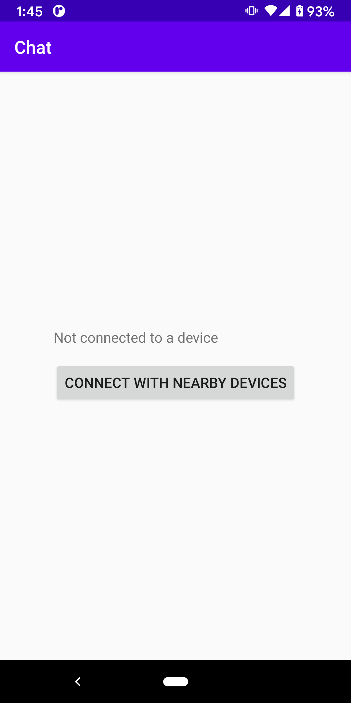
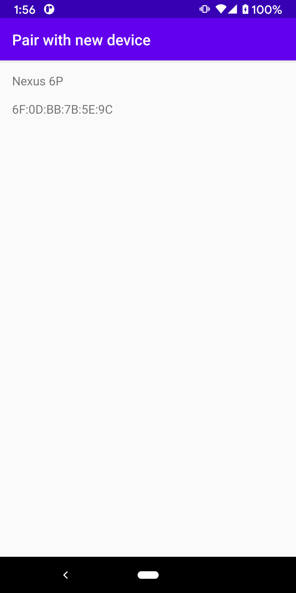
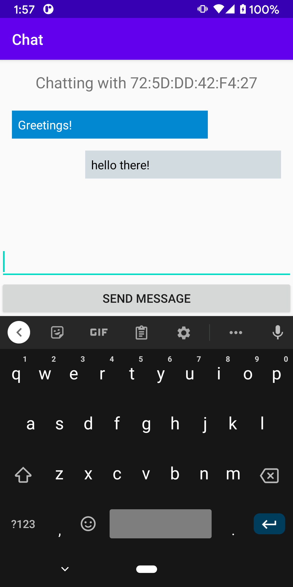

Android BluetoothLeChat Sample
===================================

This sample shows how to implement two-way text chat over Bluetooth Low Energy between two Android devices, using
all the fundamental Bluetooth LE API capabilities.

Introduction
------------

This sample should be run on two Android devices at the same time, to establish a two-way chat over
Bluetooth LE between the devices. Click the "Connect with nearby devices" button on both devices and
select the device name on the pair screen to establish the connection.

The sample demonstrates the following, using the [Bluetooth LE API][1]:

1. [Setting up][2] Bluetooth LE
2. [Scanning][3] for other Bluetooth LE devices
3. [Connecting][4] to a GATT server on a remote device
4. [Read][5] BLE attributes from the GATT server
6. [Close][6] the connection when it is no longer needed

[1]: https://developer.android.com/guide/topics/connectivity/bluetooth/ble-overview.md
[2]: https://developer.android.com/guide/topics/connectivity/bluetooth/setup.md
[3]: https://developer.android.com/guide/topics/connectivity/bluetooth/find-ble-devices.md
[4]: https://developer.android.com/guide/topics/connectivity/bluetooth/connect-gatt-server.md
[5]: https://developer.android.com/guide/topics/connectivity/bluetooth/transfer-ble-data.md
[6]: https://developer.android.com/guide/topics/connectivity/bluetooth/connect-gatt-server.md

Pre-requisites
--------------

- Android SDK 30
- Android Build Tools v30.0.2

Screenshots
-------------

   

Getting Started
---------------

This sample uses the Gradle build system. To build this project, use the
"gradlew build" command or use "Import Project" in Android Studio.

Support
-------

- Stack Overflow: http://stackoverflow.com/questions/tagged/android

If you've found an error in this sample, please file an issue:
https://github.com/android/connectivity

Patches are encouraged, and may be submitted by forking this project and
submitting a pull request through GitHub. Please see CONTRIBUTING.md for more details.
