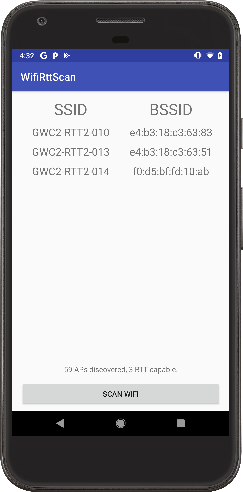
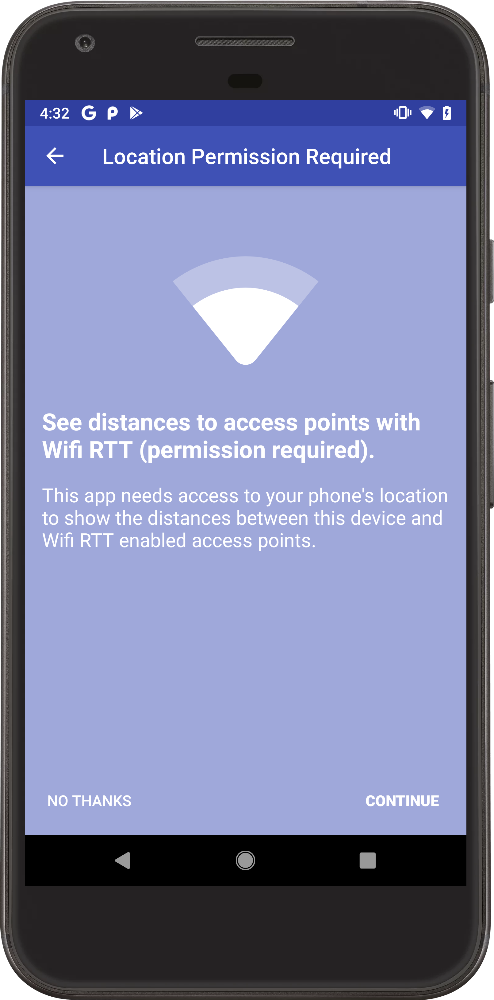
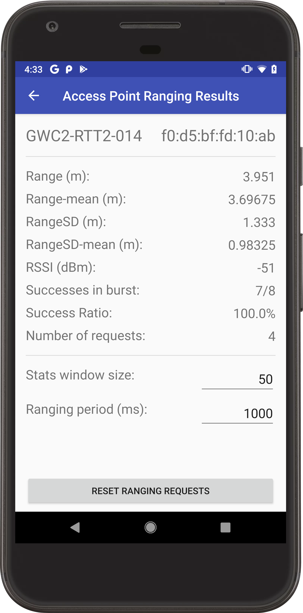

Android WifiRttScan Sample
===================================

Sample demonstrates best practices for using WifiRTT APIs in Android. Also, this is a a useful
application for testing Wifi-RTT enabled phones and access points and validating the estimated
distance is close to the actual distance between them.

Introduction
------------

Steps for trying out the sample:
* Compile and install the mobile app onto your mobile device (for mobile scenario).

This sample demonstrates best practices for using the WifiRtt APIs in Android. The main activity
lists all access points that are WifiRtt enabled using the [WifiManager][1]. By clicking on one of
the access points, another activity will launch and initiate [RangingRequest][2] via the
[WifiRttManager][3]. The activity will display many of the details returned from the access point
including the distance between the access point and the phone.

[1]: https://developer.android.com/reference/android/net/wifi/WifiManager
[2]: https://developer.android.com/reference/android/net/wifi/rtt/RangingRequest
[3]: https://developer.android.com/reference/android/net/wifi/rtt/WifiRttManager

Pre-requisites
--------------

- Android SDK 28
- Android Build Tools v28.0.3
- Android Support Repository

Screenshots
-------------

   

Getting Started
---------------

This sample uses the Gradle build system. To build this project, use the
"gradlew build" command or use "Import Project" in Android Studio.

Support
-------

- Stack Overflow: http://stackoverflow.com/questions/tagged/android

If you've found an error in this sample, please file an issue:
https://github.com/android/connectivity

Patches are encouraged, and may be submitted by forking this project and
submitting a pull request through GitHub. Please see CONTRIBUTING.md for more details.
